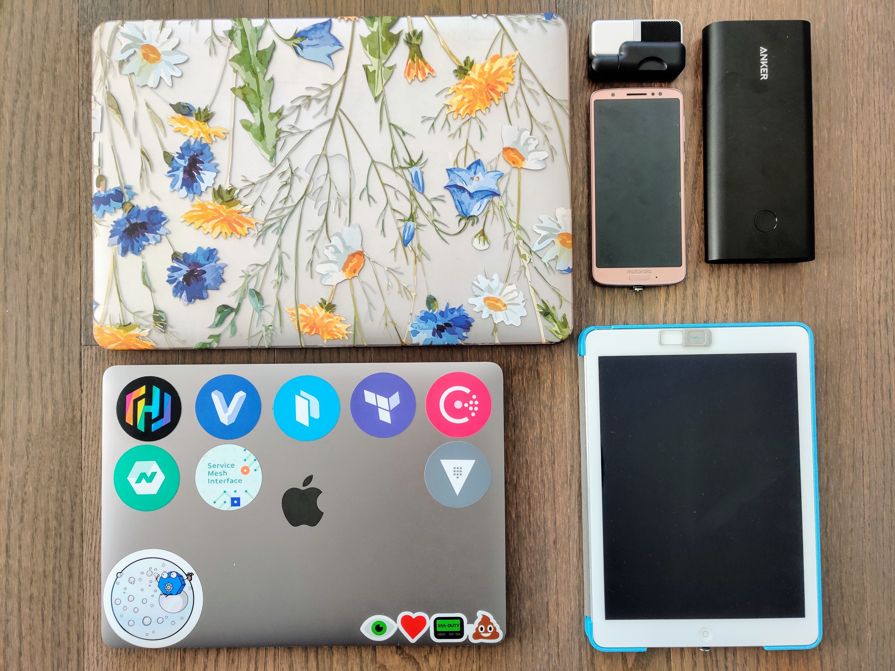

## Remote Desktop, Continuously Delivered

DevOpsDaysPHL | October 23, 2019

@joatmon08

---

## So...many...devices...

<small>#notsponsored</small>

---

## Why?

Security (IP, PII)

Developer Productivity

I ❤️ my dev machine.

---

## It's a problem rooted in the physical.

In 2017, 6.4 Mt of electronic waste [in the US](https://collections.unu.edu/eserv/UNU:6341/Global-E-waste_Monitor_2017__electronic_single_pages_.pdf)

Time wasted in security

My back

---

## "We can't just let changes go right to production without manual intervention."

---

## A Test...

Build an immutable image of my desktop tools.

Deploy to the region of my choice.

Run it on my tablet.

Travel lighter.

---

## Let's test the limits of continuous delivery.

---

## Conclusion

Sometimes, infrastructure is tough to CD.

Accrue tech debt in human intervention.

Balance the bespoke vs. the immutable

---

## Better ways of working, both in process and in the physical.

--

## Thank you!

Rosemary Wang (she/her)

Developer Advocate, HashiCorp

@joatmon08