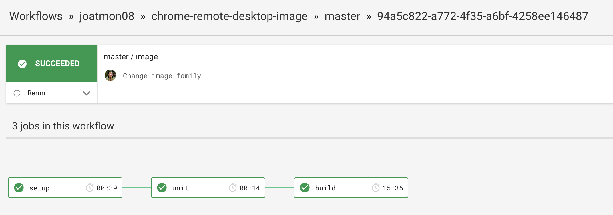

## Remote Desktop, Continuously Delivered

DevOpsDaysPHL | October 23, 2019

@joatmon08

---

## So...many...devices...

<small>#notsponsored</small>

---

## Why?

Security (IP, PII)

Developer Productivity

I ❤️ my dev machine.

---

## Physical isolation is better over logical.

---

### Right?

In 2017, 6.4 Mt of electronic waste [in the US](https://collections.unu.edu/eserv/UNU:6341/Global-E-waste_Monitor_2017__electronic_single_pages_.pdf)

(>1 Million Elephants)

---

### We don't trust logical isolation.

- Why I can't just carry one laptop

- Why we can't push to production without manual intervention

---

## Let's test the limits of continuous delivery.

---

1. Build an immutable image of my desktop tools.

1. Deploy to the region of my choice.

1. Run it on my tablet and travel lighter.

---

## Step 1: Build an immutable image of my desktop tools.

---

TO DO: Security scanning.

---

### Challenge: Find an automated remote desktop

[Chrome Remote
Desktop](https://cloud.google.com/solutions/chrome-desktop-remote-on-compute-engine)

TO DO: Figure out manual refresh token. 

---

### Challenge: Bake my favorite IDE into the image.

[Virtual Studio Code](https://code.visualstudio.com/docs/setup/linux)

---

### Challenge: Bake my favorite IDE plugins into the image.

[Virtual Studio Code CLI Extension Management](https://code.visualstudio.com/docs/editor/extension-gallery#_command-line-extension-management)

---

## Step 2: Deploy to the region of my choice.

---

## Step 3: Run it on my tablet and travel lighter.

---

## Conclusion

Sometimes, infrastructure is tough to CD.

Accrue tech debt in human intervention.

Balance the bespoke vs. the immutable

---

## Better ways of working, both in process and in the physical.

--

## Thank you!

Rosemary Wang (she/her)

Developer Advocate, HashiCorp

@joatmon08